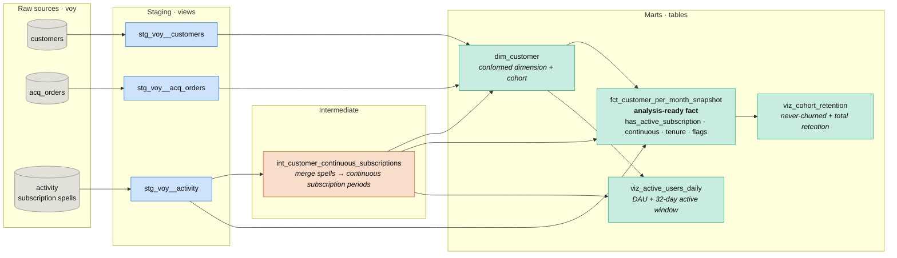

# Model lineage (DAG)

Flow: **raw spells → merge to continuous subscription periods → stamp customer-months → aggregate for reporting.**

| Layer | Model | Purpose |
|---|---|---|
| Staging | `stg_voy__*` | clean/type/rename the three sources; `Unknown` taxonomy bucket |
| Intermediate | `int_customer_continuous_subscriptions` | **core** — merge each customer's spells into continuous subscription periods (gaps-and-islands) |
| Mart | `dim_customer` | conformed customer dimension + cohort assignment |
| Mart | `fct_customer_per_month_snapshot` | **analysis-ready** customer × month fact — the table to query |
| Mart | `viz_cohort_retention` | cohort × tenure never-churned + total retention |
| Mart | `viz_active_users_daily` | daily active users (DAU + 32-day window) |

_Metrics: never-churned & total retention come from `viz_cohort_retention`; churn and reactivation derive from `fct_customer_per_month_snapshot`; active-user counts from `viz_active_users_daily`._
